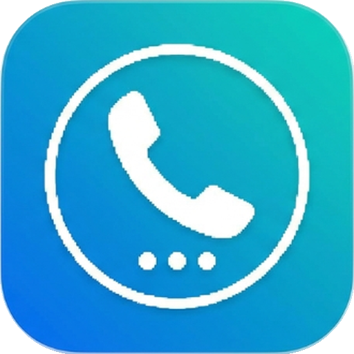

  

<h1 align="center">Dialer Vault</h1>

  <b>The Ultimate Stealth Privacy Vault Camouflaged as a Working Phone Dialer</b> 
  <i>Protect your confidential photos, videos, audio, and documents behind an authentic telephone keypad.</i>

  
  
  
  
  

  
  

---

## ?? What is Dialer Vault?

**Dialer Vault** looks, feels, and acts like a standard system phone dialer. It features a responsive telephone keypad, dial tone acoustics, and standard calling operations. But enter your **secret PIN sequence** (such as `#1234#`), and the dialer instantly transforms into a **military-grade private vault** for your most sensitive media, files, and personal memories.

---

## ?? Key Features

### ?? Authentic Phone Dialer Camouflage
- Looks identical to a modern, elegant phone dialer.
- Generates authentic DTMF dial tones upon key presses.
- Hides your private data in plain sight—no one looking at your phone will suspect a vault is hidden beneath.

### ?? Refer & Earn Free Cloud Storage (+10 GB Permanent)
- **Zero Subscriptions or Paywalls**: Completely free permanent cloud backup rewards.
- **Invite Friends, Unlock Storage**: Each friend who joins using your unique referral code grants you **+10 GB of permanent cloud storage**.
- **Dynamic Quota Allocation**: `Base Free Storage (10 GB) + (Referrals × 10 GB)`.
- **Easy One-Tap Sharing**: Share your referral invite code via WhatsApp, SMS, Telegram, or social media in seconds.

### ??? Hardware-Backed AES-256-GCM Encryption
- Files are encrypted on-device before storage using **AES-256-GCM** keys secured by the **Android Keystore**.
- Direct memory-level file streaming prevents unencrypted data from ever touching disk cache.

### ?? Decoy / Fake PIN Mode
- Forced to unlock your phone? Enter your configured **Decoy PIN**.
- The app immediately opens an empty or dummy vault containing harmless decoy media, ensuring your true vault remains hidden under duress.

### ?? Intruder Selfie & Break-In Detection
- Front camera automatically snaps a silent, timestamped photograph whenever an incorrect passcode is dialed.
- Inspect intrusion logs and timestamps inside the vault settings to know who attempted unauthorized access.

### ?? Zero-Knowledge Cloud Backup & Sync
- Multi-threaded cloud backup with chunked upload, SHA-256 integrity verification, and instant restoration.
- Auto-backup on Wi-Fi keeps your private media safe even if your phone is lost or damaged.

### ?? AMOLED Dark Mode & Clean Modern UI
- Native Material 3 design system built entirely with **Jetpack Compose**.
- High-contrast pure dark mode optimized for OLED battery efficiency and eye comfort.

---

## ?? Quick Installation

1. Download the latest signed APK directly from this repository:
   - **[Download DialerVault-v1.4.0.apk (4.1 MB)](DialerVault-v1.4.0.apk)**
   - Alternative generic link: **[DialerVault.apk](DialerVault.apk)**
2. On your Android device, tap the downloaded `.apk` file.
3. If prompted, allow **"Install from unknown sources"** for your browser or file manager.
4. Open **Dialer Vault**, configure your secret master PIN on the dialpad, and set up your recovery security question.

---

## ?? How to Use

### 1. Unlocking the Vault
- Open the Dialer.
- Type your secret passcode (e.g. `#1234#`).
- The vault interface automatically unlocks.

### 2. Earning Free Cloud Storage
1. Inside the vault, tap the **Cloud Backup** icon or open **Settings > Refer & Earn Free Storage**.
2. Tap **Copy** or **Share Link** to send your unique code (`VAULT-XXXX`) to friends.
3. Have your friend tap **"Have a Friend's Referral Code?"** and enter your code to immediately claim their **+10 GB Welcome Bonus**.
4. You receive **+10 GB of permanent cloud capacity** immediately!

### 3. Setting Decoy Mode
- Open **Vault Settings > Fake PIN (Decoy Vault)**.
- Set a distinct secondary PIN (e.g. `#0000#`).
- When dialing the Decoy PIN, an isolated, blank decoy vault is presented.

---

## ??? Technology Stack

| Layer | Technology |
|---|---|
| **Language** | Kotlin 2.0+ |
| **UI Framework** | Jetpack Compose + Material 3 |
| **Architecture** | Modern Android Architecture (MVVM, UDF, Clean Architecture) |
| **Local Security** | AndroidX Security Crypto + Android Keystore (AES-256-GCM) |
| **Persistence** | Jetpack DataStore Preferences & Room Database |
| **Networking** | OkHttp 4 + Retrofit REST Engine |
| **Cloud Storage** | Distributed S3-compatible backend & Firebase RTDB |
| **Minification** | ProGuard + R8 full optimization (Shrunk to 4.1 MB) |

---

## ?? Release Notes (v1.2.0)

- **Referral Rewards Engine**: Added permanent **+10 GB free cloud storage** bonus per referral, removing all paywalls.
- **Brand New App Icon**: Upgraded app branding with high-resolution adaptive icon assets and modern launcher artwork.
- **Cleaned Security Architecture**: Completely eliminated legacy third-party payment gateway dependencies.
- **Data Protection Compliance**: Fixed Android 12+ `<data-extraction-rules>` XML specifications for full backup safety.
- **Size Optimization**: Enabled R8 code minification and resource shrinking, reducing APK size to just **4.1 MB**.

---

  Made with ?? by <a href="https://github.com/Operantix"><b>Operantix</b></a>

